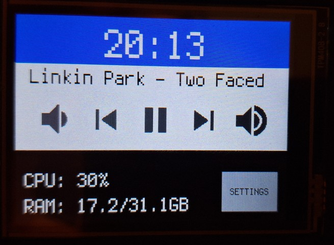

# Pico Sidekick

DIY helper screen for Windows PC.

Built with:
- Raspberry Pi Pico
- cheap 2.8" TFT touch screen, with ILI9341 and XPT2046 controllers and 240x320 resolution

Software components:
- CircuitPython software on Pico
- Windows PC host built with C#/.NET 9

Components are connected using USB CDC serial port

## Function roadmap
- [x] Clock
- [x] Currently played music/other media
- [x] CPU and RAM usage
- [x] Play/Pause button
- [x] Shutdown computer button
- [ ] Volume up/down button
- [ ] TFT screen brightness adjustment

## Installation on Raspberry Pi Pico

### From released uf2 file
1. Get `.uf2` file from 
2. Hold `BOOTSEL` button and connect Pi to PC
3. Put `.uf2` file on `RPI-RP2` drive

### From scratch
1. Install CircuitPython on Raspberry Pi Pico \
https://learn.adafruit.com/getting-started-with-raspberry-pi-pico-circuitpython/circuitpython
2. Connect Pico to USB port, `CIRCUITPY` drive should appear
3. Install Adafruit libraries. This can be done using `circup` utility \
https://github.com/adafruit/circup \
`circup install adafruit_button adafruit_hid asyncio adafruit_display_text adafruit_ili9341 adafruit_displayio_layout`
4. Remove preinstalled `code.py` file and put files from `PicoClientScreen` directory into `CIRCUITPY` drive
5. Disconnect Pico from USB and connect it again

## References:
1. https://helloraspberrypi.blogspot.com/2021/04/raspberry-pi-picocircuitpython-ili9341.html
